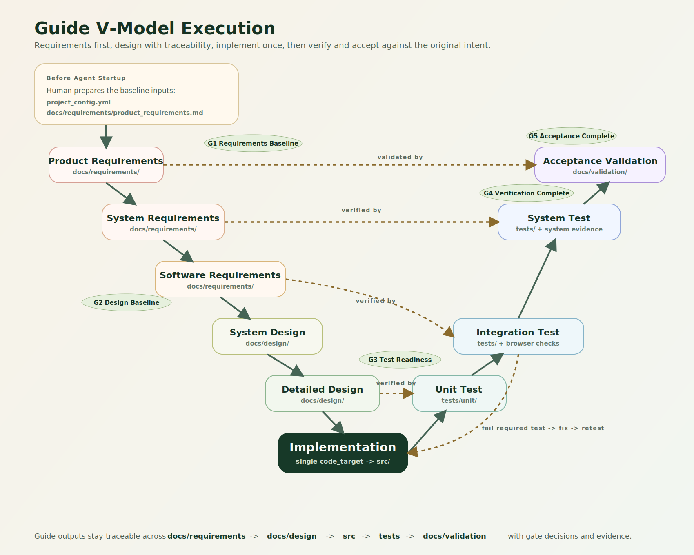
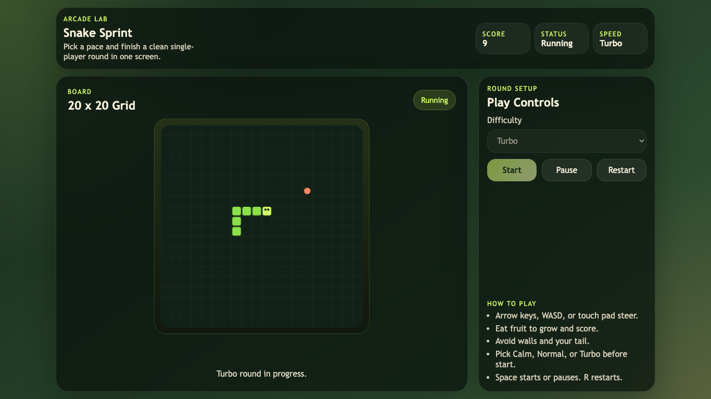

# Agent Coding Guide

[English](./README.md) | 简体中文

> 一套面向真实项目、以 V 模型为骨架、强调“需求先行”的 Agent 开发指南。

如果你喜欢 Agent 写代码的速度，却不想在收尾时面对一堆说不清、对不上的产物，这个仓库就是为这种情况准备的。`Agent Coding Guide` 提供了一组轻量但有约束力的规则、模板和运行约定，并用一个精简版 V 模型来组织整个交付过程: 先明确需求和设计，再进入实现，最后通过分层验证和最终验收把前面的约束一层层对回来。

它不是框架，也不是代码生成器。更像是一套可以放在真实项目旁边使用的交付工作手册。



下图是一个完全由 Agent 按照本指南——从需求到验收——交付的贪吃蛇游戏截图，用于展示完整的交付工作流。



## 为什么你可能会用到它

很多 Agent 工作流都很擅长快速产出代码，但不一定擅长留下一个几天后仍然讲得清楚的项目状态。

这套 guide 更适合下面这些需求：

- 希望需求始终约束实现，而不是写着写着跑偏
- 希望设计和测试文档能回溯到需求，而不是“有文档但没作用”
- 希望仓库里始终只有一个明确的 `code_target`
- 希望“完成”这件事有验证证据支撑，而不是凭感觉
- 希望流程有基本纪律，但又不想把项目拖进一套很重的流程体系

## 核心前提

在 Agent 启动前，需要先准备好两项输入：

- `project_config.yml`
- `docs/requirements/product_requirements.md`

其中，`docs/requirements/product_requirements.md` 是整个流程真正的起点。它不是补充说明；如果 README 和需求文档有冲突，应以需求文档为准。

后续的需求评审、设计文档、测试计划、验证证据、验收结论以及发布收尾，都应从这份基线继续展开。

## 工作区结构

`agent_coding_guide/` 和项目本身应放在同一个工作区里，并作为并列目录存在：

```text
workspace/
├── agent_coding_guide/
└── my-project/
    ├── agent_startup.md
    ├── project_config.yml
    ├── src/
    ├── docs/
    └── tests/
```

项目中通常会通过下面这样的路径引用 guide 里的规则文件：

- `../agent_coding_guide/governance/workflow_protocol.md`
- `../agent_coding_guide/governance/product_registry.yaml`

## 它能提供什么

- 规定 Agent 启动时应按什么顺序读取文件的 startup 模板
- requirements、design、verification、validation、quality 的标准输出模板
- 一套从需求基线走到验收闭环的门禁式交付流程
- 让代码、文档和测试目录保持稳定的仓库结构约定

默认流程：

`product_requirements -> system_requirements -> software_requirements -> system_design -> detailed_design -> implementation -> unit_test -> integration_test -> system_test -> acceptance_validation -> release_retro`

强制门禁：

- `G1 Requirements Baseline`
- `G2 Design Baseline`
- `G3 Test Readiness`
- `G4 Verification Complete`
- `G5 Acceptance Complete`

## 快速开始

1. 把 `agent_coding_guide/` 放到你的项目同级目录。
2. 根据 [templates/inputs/project_config_template.yaml](./templates/inputs/project_config_template.yaml) 创建 `project_config.yml`。
3. 根据 [templates/inputs/product_requirements_template.md](./templates/inputs/product_requirements_template.md) 创建 `docs/requirements/product_requirements.md`。
4. 根据 [templates/inputs/agent_startup_template.md](./templates/inputs/agent_startup_template.md) 创建 `agent_startup.md`。
5. 从 `agent_startup.md` 启动 Agent。

启动后，Agent 应先读取准备好的 requirements，再基于这份基线推导后续工件，而不是只根据 README 自行发挥。

## 继续了解

- 运行规则：[workflow_protocol.md](./governance/workflow_protocol.md)
- 产品路由：[product_registry.yaml](./governance/product_registry.yaml)
- 指南概览：[overview.md](./overview.md)

## 许可证
Apache 2.0，见 [LICENSE](./LICENSE)。
