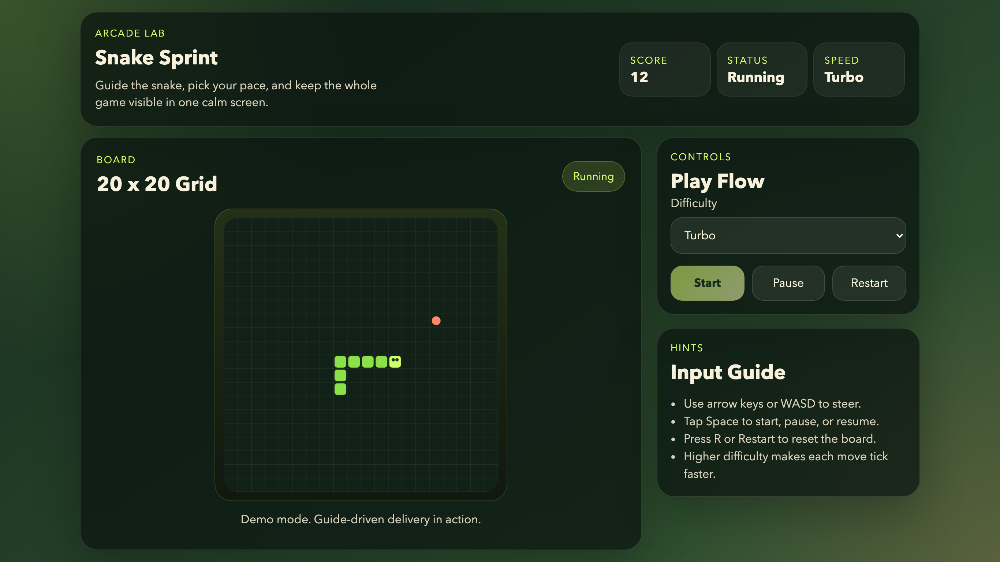

# Agent Coding Guide

[English](./README.md) | 简体中文

[](./LICENSE)
[](#支持范围)
[](#支持的产品类型)

一个面向 AI Coding Agent 的轻量级、仓库优先的交付指南。

`Agent Coding Guide` 旨在帮助单个 Agent 在真实软件仓库中开展工作，提供更清晰的输入约定、更严格的目录约束、可复用的模板，以及显式的验收流程。

它不是一个 Agent 运行时或编排平台，而是一套可以直接放进代码仓库中的实践型操作规范，用来让 Agent 驱动的交付更稳定、更可审计，也更容易被人类协作者复核。

## Demo 演示

下面这张截图展示了一个按这套 guide 在示例仓库中交付出来的可玩贪吃蛇游戏。



## 为什么要做这个项目

很多 AI Coding 工作流最终会在同样的地方失控：

- 需求描述不够完整
- Agent 在仓库里随意落文件
- 过程、决策和返工没有记录
- 测试证据不完整
- 验收标准变得主观

这个仓库提供了一套小而明确、但有约束力的交付契约，用来解决这些问题。

## 功能特性

- **单 Agent 交付流程**，明确划分 `requirement -> architecture -> build -> test -> accept -> knowledge_review -> retro`
- **仓库结构护栏**，让产品代码、测试、文档和指南资产落在可预测的位置
- **基于角色的职责拆分**，覆盖 master、architecture、implementation、testing
- **输入/输出模板**，涵盖 startup、requirements、进度跟踪、设计、测试报告、验收和缺陷记录
- **以验收为中心的执行方式**，要求每条必需验收标准都映射到具体的验证证据
- **可复用的知识沉淀**，将解决方案、模式和踩坑经验落成知识笔记
- **产品注册表机制**，用于定义支持的产品类型、默认构建角色和默认代码落点

## 支持的产品类型

当前内置支持：

- `web`：浏览器 / Web 交付，包含视口和布局相关的验收指导
- `python`：本地 Python 脚本或运行时交付

## 支持范围

当前版本支持：

- `agents: 0|1`
- 一个已注册的 `product`
- 一个明确选定的 `code_target`
- 持久化交付产物落在 `docs/` 与 guide 约定文件中

当前版本**不尝试**处理：

- 多 Agent 协同
- 分布式任务执行
- 自治式基础设施编排
- 复杂项目管理平台能力

## 仓库结构

```text
agent_coding_guide/
├── assets/                 # README 演示图片和其他指南媒体资源
├── agents/                 # 各交付阶段的角色定义
├── governance/             # 流程协议与产品注册表
├── knowledges/             # 可复用工程知识笔记
├── templates/
│   ├── inputs/             # startup、config、README、requirements 模板
│   └── outputs/            # design、test、acceptance、diary、defect 模板
├── overview.md             # 项目概览
├── README.md
├── README.zh-CN.md
└── LICENSE
```

## 核心规则

- `requirements.md > README.md`
- 产品代码必须写入选定的 `code_target`
- 测试工具默认放在根目录 `tests/`
- 持久化文档默认放在 `docs/`
- 指南资产默认放在 `agent_coding_guide/`
- 所有必需验收标准都必须有通过的验证证据
- 没有明确理由的新根级文件或目录应视为流程违规

## 快速开始

### 1. 将 guide 放到 Agent 可访问的位置

这套 guide 有两种都可接受的摆放方式：

```text
workspace/
├── your-project/
│   ├── README.md
│   ├── requirements.md
│   ├── project_config.yml
│   └── agent_startup.md
└── agent_coding_guide/
```

或者：

```text
your-project/
├── agent_coding_guide/
├── README.md
├── requirements.md
├── project_config.yml
└── agent_startup.md
```

`agent_coding_guide/` 不一定要放进项目仓库内部。只要 Agent 能同时读取项目文件和 guide 文件，把它作为项目的同级目录也是完全可行的。

### 2. 用模板初始化 4 个必需的根文件

直接使用 [`templates/inputs/`](./templates/inputs) 下的输入模板：

- [`templates/inputs/readme_template.md`](./templates/inputs/readme_template.md) -> `README.md`
- [`templates/inputs/requirements_template.md`](./templates/inputs/requirements_template.md) -> `requirements.md`
- [`templates/inputs/project_config_template.yaml`](./templates/inputs/project_config_template.yaml) -> `project_config.yml`
- [`templates/inputs/agent_startup_template.md`](./templates/inputs/agent_startup_template.md) -> `agent_startup.md`

`project_config.yml` 示例：

```yaml
agents: 1
product: web
code_target: src
docs:
  - design
  - test_report
  - acceptance
```

### 3. 确认启动所需文件齐全

最小必需项目文件为：

- `README.md`
- `requirements.md`
- `project_config.yml`
- `agent_startup.md`
- 能访问到 `agent_coding_guide/`，无论它位于项目内还是项目同级目录

这些内容共同构成这套指南的最小有效启动集合。

### 4. 用这套指南启动 Agent

当这些文件准备好之后，你只需要让 Coding Agent 从 `agent_startup.md` 开始即可。

`agent_startup.md` 是项目的唯一启动入口。后续该读哪些文件、以谁为真源、如何路由流程、应该产出哪些文档，都由这套 guide 自动接管。

实际给 Agent 的启动指令可以非常简单：

```text
从 `agent_startup.md` 开始，并遵循 guide 自动开发。
```

## 工作流

这套指南使用一条明确而简洁的流程：

1. **Requirement**：归一化需求范围，并把验收标准映射为计划中的验证证据
2. **Architecture**：定义边界、模块、约束，并选择唯一的 `code_target`
3. **Build**：只实现确认在范围内的内容
4. **Test**：验证行为并记录证据、失败项和缺陷
5. **Accept**：只有当全部必需检查都有通过证据时才能验收
6. **Knowledge Review**：沉淀可复用经验，或明确记录为什么跳过知识沉淀
7. **Retro**：总结决策并闭环交付

## 标准输出

这套指南统一了以下常见交付产物：

- `project_process.md`
- `agent_work_diary.md`
- `docs/design.md`
- `docs/test_report.md`
- `docs/acceptance.md`
- `docs/defects/<id>.md`，当需要记录缺陷时
- `docs/security.md`，当涉及敏感变更时
- `agent_coding_guide/knowledges/<type>/<feature>.md`，用于沉淀可复用知识

所有对应模板都位于 [`templates/outputs/`](./templates/outputs)。

## 角色说明

内置角色保持得很轻量：

- [`Master`](./agents/master_agent.md)：负责路由流程、维护进度记录、做最终验收判断
- [`Architecture`](./agents/architecture_agent.md)：负责边界、约束和 `code_target` 设计
- [`SW Web`](./agents/sw_web_agent.md)：负责 Web / 浏览器产品实现
- [`SW Python`](./agents/sw_python_agent.md)：负责 Python 运行时产品实现
- [`Testing`](./agents/testing_agent.md)：负责验证证据并把关验收

## 适用场景

- 约束 AI 生成代码始终写在可预测的仓库结构中
- 为内部 AI 辅助开发项目统一交付文档
- 给快速原型开发补上更严格的验收机制
- 为本地 Coding Agent 建立一套轻量级操作模型
- 把交付中的经验沉淀为可复用知识，而不是散落在聊天记录里

## 设计原则

- **Small over comprehensive**：协议故意保持收敛，而不是追求面面俱到
- **Evidence over optimism**：必需行为必须有验证证据
- **Repo-first over platform-first**：仓库本身才是交付真源
- **Reuse over drift**：优先复用现有结构，而不是持续新增根目录
- **Documentation as delivery artifact**：进度、测试和验收本身就是交付的一部分

## 什么时候适合使用

如果你希望获得以下能力，这个仓库很适合：

- 一套轻量的 AI 辅助交付标准
- 更严格的仓库结构和验收纪律
- 一种让 Agent 工作结果更易于人工复核的方式

如果你想要的是下面这些东西，那它可能并不适合：

- 通用 Agent 框架
- 多 Agent 调度系统
- 托管式工作流或编排平台

## License

本项目采用 Apache License 2.0。详见 [`LICENSE`](./LICENSE)。
